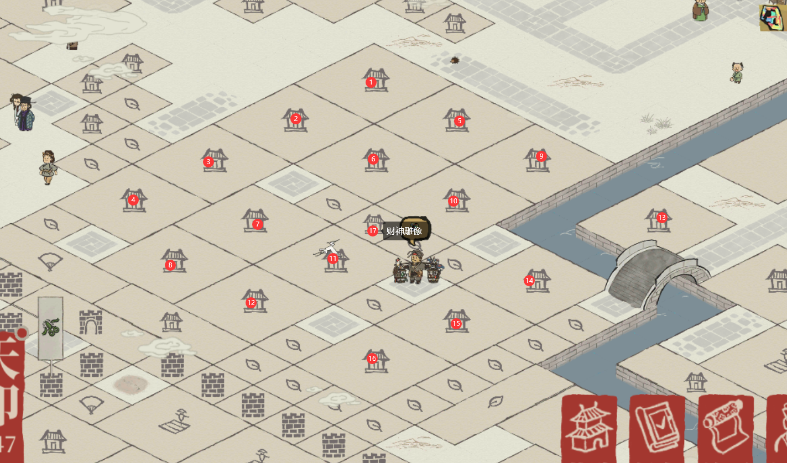

# JiangNan100Well2
江南百景图_水井刷铜币脚本

## 写在前面

0. 本脚本需要一定python基础
1. 本脚本需要配合电脑模拟器使用
2. 本脚本无法破解v1.2.6版本更新的拼图小游
3. 纯基于模拟点击,无图像识别功能, 因此可能存在以下问题:
   1. 在触摸点浮动时误触其他图像导致工作错误
   2. 点击时正好有土行孙/补天石小贩/西域商人/居民对话经过导致工作失败
   3. 由于模拟器触摸不灵敏导致点击遗漏
4. 在非等待态的情况下,长按ESC键可以强行终止下一次点击
5.  在非等待态的情况下,将鼠标移至桌面的四个角落之一可强行终止程序
6. 本脚本仅用于学习交流,禁止用于商业用途(虽然写的这么烂谁会用来商业用途),否则引起的相关责任与开发者无关
7. 我曾在极端愤怒的情况下一晚上写完了这个脚本


## 重构

陆陆续续重构了整份代码, 基本和原来的是两份脚本了. 主要更新有以下几点

1. 防拼图机制

   由于我不想专门写个识别并解决拼图的代码, 选择规避拼图机制的触发. 在经过最初几天无差别攻击后, 拼图的触发机制优化了很多, 也正因为此我们可以尽可能真实地模拟用户操作来规避拼图的触发. 规避的实现主要依赖于: 

   - 利用画室而非水井进行刷钱, 虽然画室的绝对收益效率远低于水井, 但是脚本本身是求稳, 长期画室的收益也相当可观. 此外, 由于每次操作本身会产生大量时间开销, 出错的概率相对更大
   - 在每完成一次操作后进行画面的拖动.同时为了避免画面拖动带来的定位错误, 现在每10次生产后会在应天, 苏州之间切换城市重定位.

   以上两者导致了生产收益的相对降低.但更加稳健

2. 后台等待机制

   引入了新库, 在开始生产后自动将界面最小化, 成熟后将界面最大化(并伴有蜂鸣提醒) 

3. 现在可以选择是否开启税课司了

4. 引入了安全区的概念, 导致代码使用更加复杂, 但容错率更高

5. 考虑到也没人会用这个脚本, 我选择直接将逻辑链写死在代码里, 现在应该不支持自定义位置了. 必须按照我的地图来.(应天--画室摆放)

   


## 用到的库

1. PyAutoGui 

   这是一个使用python模拟鼠标操作的开源库. 简单易用.

   安装

   ```
   pip install pyautogui
   ```

   [🔗文档链接](https://pyautogui.readthedocs.io/en/latest/)

   [🔗GitHub仓库](https://github.com/asweigart/pyautogui)

2. keyboard

   这是一个使用python模拟键盘操作的开源库, API较多

   安装

   ```
   pip install keyboard
   ```

   [🔗文档与仓库](https://github.com/boppreh/keyboard)
   
3. win32gui

   Python extensions for Microsoft Windows’ Provides access to much of the Win32 API, the ability to create and use COM objects, and the Pythonwin environment

   [🔗主页](https://pypi.org/project/win32gui/)

   